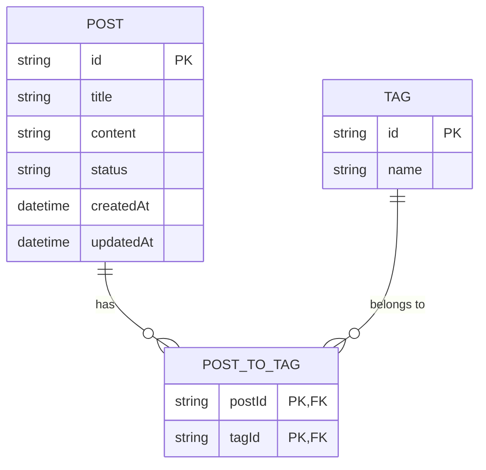
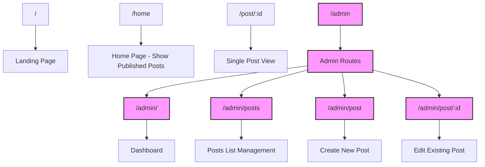

# Personal Blogging System Implementation Plan

## 1. Database Schema

We'll create a simplified blog schema with post status control:

```typescript
// src/db/schema/blog-schema.ts
import { sqliteTable, text, integer } from "drizzle-orm/sqlite-core"

export const post = sqliteTable("post", {
  id: text("id").primaryKey(),
  title: text("title").notNull(),
  content: text("content").notNull(),
  // Status can be: "published", "draft", "private"
  status: text("status").notNull().$defaultFn(() => "draft"),
  createdAt: integer("created_at", { mode: "timestamp" })
    .$defaultFn(() => new Date())
    .notNull(),
  updatedAt: integer("updated_at", { mode: "timestamp" })
    .$defaultFn(() => new Date())
    .notNull(),
})

export const tag = sqliteTable("tag", {
  id: text("id").primaryKey(),
  name: text("name").notNull().unique(),
})

export const postToTag = sqliteTable("post_to_tag", {
  postId: text("post_id")
    .notNull()
    .references(() => post.id, { onDelete: "cascade" }),
  tagId: text("tag_id")
    .notNull()
    .references(() => tag.id, { onDelete: "cascade" }),
  // Composite primary key
  primaryKey: { columns: ["post_id", "tag_id"] },
})

export type Post = typeof post.$inferSelect
export type Tag = typeof tag.$inferSelect
```

Then update the schema index file to export the blog schema:

```typescript
// src/db/schema/index.ts
export * from "@/db/schema/auth-schema"
export * from "@/db/schema/blog-schema"
```

## 2. Application Structure

Here's the structure we'll need to implement:

```
src/
├── app/
│   ├── pages/
│   │   ├── Home.tsx (Updated to show public posts)
│   │   ├── Post.tsx (Public post view page)
│   │   ├── admin/
│   │   │   ├── routes.ts (Admin routes definition)
│   │   │   ├── Dashboard.tsx (Admin dashboard)
│   │   │   ├── Posts.tsx (List all posts with management options)
│   │   │   ├── PostEditor.tsx (Create/edit post with markdown editor)
│   │   │   └── components/
│   │   │       ├── PostForm.tsx (Form for creating/editing posts)
│   │   │       ├── PostList.tsx (Component for listing posts)
│   │   │       └── MarkdownEditor.tsx (Markdown editor component)
│   ├── shared/
│   │   ├── components/
│   │   │   ├── ui/
│   │   │   │   ├── textarea.tsx (Textarea component for markdown editor)
│   │   │   │   ├── tag-input.tsx (Component for managing tags)
│   │   │   │   └── markdown-preview.tsx (Component for previewing markdown)
```

## 3. Routing Structure

We'll update the routing structure to include the admin routes and public post view:

```typescript
// src/worker.tsx (updated)
import { adminRoutes } from "@/app/pages/admin/routes"

// ...existing code...

export default defineApp([
  // ...existing middleware...

  render(Document, [
    route("/", Landing),
    route("/home", Home), // Public home page with published posts
    route("/post/:id", Post), // Public post view
    route("/admin", [isAuthenticated, adminRoutes]), // Admin routes (protected)
    prefix("/user", userRoutes),
  ]),
])
```

```typescript
// src/app/pages/admin/routes.ts
import { route } from "rwsdk/router"
import { Dashboard } from "@/app/pages/admin/Dashboard"
import { Posts } from "@/app/pages/admin/Posts"
import { PostEditor } from "@/app/pages/admin/PostEditor"

export const adminRoutes = [
  route("/", Dashboard),
  route("/posts", Posts),
  route("/post", PostEditor),
  route("/post/:id", PostEditor),
]
```

## 4. Implementation Details

[Implementation details sections omitted for brevity - see previous versions]

## 5. Migration Plan

1. Create the blog schema files
2. Update the schema index to export the blog schema
3. Create a migration for the new tables
4. Create the UI components for the admin section
5. Implement the admin routes
6. Update the Home page to display posts
7. Create the public post view page
8. Test the functionality

## 6. Technical Considerations

1. **Authentication**: We'll leverage the existing authentication system to ensure only you (the admin) can access the admin routes.

2. **Post Status**: We've implemented three status options:
   - **Draft**: Posts that are still being worked on and not ready for publication
   - **Published**: Posts that are visible to the public
   - **Private**: Posts that are only visible to you when logged in

3. **Markdown Editing**: The markdown editor provides a simple editing experience with preview functionality. In a production environment, you might want to use a more robust solution like CodeMirror or a dedicated markdown editor library.

4. **Database Schema**: We're using a relational approach with separate tables for posts, tags, and a junction table for the many-to-many relationship between posts and tags.

5. **Security**: We ensure that only published posts are visible to the public, while you can see all posts when logged in.

## 7. Future Enhancements

1. **Comments**: Add a commenting system for blog posts
2. **Rich Text Editor**: Upgrade to a more feature-rich editor
3. **Image Upload**: Add support for uploading and embedding images in posts
4. **Search**: Implement search functionality for posts
5. **Categories**: Add support for categorizing posts beyond just tags
6. **Analytics**: Add basic analytics for post views and engagement

## 8. Database Schema Diagram



## 9. Routing Structure Diagram



## 10. Conclusion

This plan outlines a comprehensive approach to implementing a personal blogging system with the following key features:

- A clean, modern UI for both public-facing blog and admin interfaces
- Markdown-based content editing with preview functionality
- Tag support for organizing content
- Post status control (draft/published/private)
- Secure admin area for managing all blog content

The implementation leverages the existing project structure and authentication system, making it a natural extension of the current application. By following this plan, you'll have a fully functional personal blogging system that you can extend with additional features in the future.