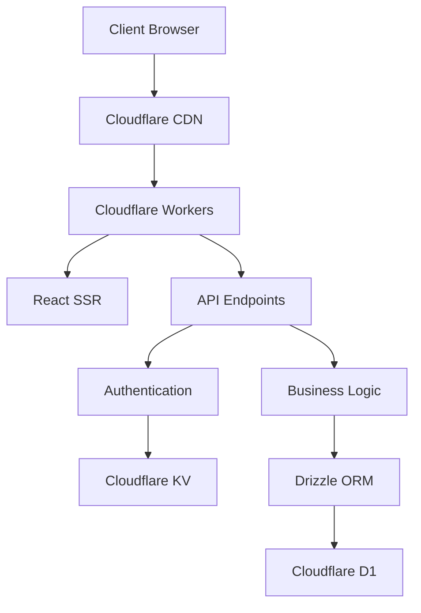

# Fullstack Cloudflare Example - Development Notes

## Project Overview

This project is a full-stack web application built on Cloudflare's ecosystem, combining modern frontend technologies with serverless backend capabilities. It features a React frontend, Cloudflare Workers for the backend, and Cloudflare D1 for the database, creating a cohesive and performant application architecture.

## Tech Stack

### Frontend
- **Framework**: React with TypeScript
- **UI Components**: Shadcn UI (based on Radix UI primitives)
- **Styling**: Tailwind CSS
- **Build Tool**: Vite

### Backend
- **Platform**: Cloudflare Workers (serverless)
- **Runtime**: Node.js compatibility mode
- **Framework**: RWSDK (RedwoodJS-like framework for Cloudflare)
- **API Routing**: Built-in router from RWSDK

### Database
- **Database**: Cloudflare D1 (SQLite-compatible)
- **ORM**: Drizzle ORM
- **Migrations**: Drizzle Kit

### Authentication
- **Library**: better-auth
- **Method**: Email OTP (One-Time Password)
- **Storage**: Cloudflare KV for sessions, D1 for user data

### Development Tools
- **Package Manager**: Bun
- **TypeScript**: Strict mode
- **Code Formatting**: Prettier
- **Infrastructure Management**: Alchemy

## Architecture

The application follows a modern full-stack architecture with clear separation of concerns:



- **Frontend**: Server-side rendered React components with client-side hydration
- **Backend**: API routes handled by Cloudflare Workers
- **Data Flow**: RESTful API patterns with server-side rendering for initial page loads
- **Authentication**: Stateful sessions stored in KV with user data in D1

## Frontend

### Component Structure

The frontend follows a hierarchical component structure:

- `src/app/document/Document.tsx`: Root HTML document component
- `src/app/pages/`: Page-level components
- `src/app/shared/components/`: Reusable UI components
- `src/app/shared/components/ui/`: Shadcn UI components

### Routing

Routing is handled by the RWSDK router in `src/worker.tsx`:

```typescript
render(Document, [
  route("/", Landing),
  route("/home", [isAuthenticated, Home]),
  prefix("/user", userRoutes),
])
```

### State Management

- React's built-in state management with hooks
- Context API for global state (authentication)
- Server-side data fetching for initial state

## Backend

### Worker Structure

The backend is built on Cloudflare Workers using the RWSDK framework:

- `src/worker.tsx`: Main entry point defining routes and middleware
- API routes are defined using the `route()` function
- Authentication middleware for protected routes

### API Design

- RESTful API endpoints
- JSON response format
- Authentication via session tokens

### Middleware

Middleware functions can be used for:
- Authentication checks
- Request validation
- Response transformation
- Error handling

## Database

### Schema Design

The database schema is defined using Drizzle ORM in TypeScript:

- `src/db/schema/`: Database schema definitions
- `src/db/migrations/`: SQL migrations

### Tables

- `user`: User account information
- `session`: Authentication sessions
- `account`: OAuth and password accounts
- `verification`: Email verification tokens

### Querying

Database queries are performed using Drizzle ORM:

```typescript
const allUsers = await db.select().from(user).all()
```

### Migrations

Database migrations are managed with Drizzle Kit:
- Generate migrations: `bun migrate:new`
- Apply migrations: `wrangler d1 migrations apply DB --local`

## Authentication

### Flow

1. User enters email
2. System sends OTP to email
3. User verifies with OTP
4. Session is created and stored in KV
5. User is authenticated for subsequent requests

### Implementation

- `src/lib/auth.ts`: Authentication configuration
- `src/app/pages/user/Login.tsx`: Login UI
- Session management via cookies and KV storage

## Deployment

### Infrastructure

- Cloudflare Pages or Workers for hosting
- Cloudflare D1 for database
- Cloudflare KV for session storage

### Deployment Process

1. Build the application: `bun build`
2. Deploy to Cloudflare: `wrangler deploy`
3. Infrastructure setup: `bun infra:up`

### Environment Variables

Required environment variables:
- `BETTER_AUTH_SECRET`: Secret for authentication
- Database and KV bindings are configured in `wrangler.jsonc`

## Code Style Guidelines

### TypeScript

- Use TypeScript for all new code
- Enable strict mode
- Define interfaces for all data structures
- Use type inference where appropriate

### React Components

- Functional components with hooks
- Props should be typed with TypeScript interfaces
- Destructure props in function parameters
- Async components for data fetching

Example:
```typescript
interface HomeProps {
  ctx: AppContext
}

const Home = async ({ ctx }: HomeProps) => {
  // Component logic
}
```

### CSS/Styling

- Use Tailwind CSS for styling
- Follow utility-first approach
- Use Shadcn UI components when possible
- Custom styles in CSS modules when needed

### File Organization

- Feature-based organization
- Clear separation between pages and components
- Shared components in dedicated directories
- Consistent naming conventions

### Naming Conventions

- **Files**: PascalCase for components, camelCase for utilities
- **Components**: PascalCase
- **Functions**: camelCase
- **Variables**: camelCase
- **Types/Interfaces**: PascalCase
- **Constants**: UPPER_SNAKE_CASE for true constants

### Import Order

1. External libraries
2. Internal modules (with `@/` alias)
3. Relative imports
4. CSS/asset imports

Example:
```typescript
import React from 'react'
import { cva } from 'class-variance-authority'

import { db } from '@/db/db'
import { user } from '@/db/schema'

import { SubComponent } from './SubComponent'

import './styles.css'
```

## Development Workflow

### Setup

1. Clone the repository
2. Install dependencies: `bun install`
3. Copy `.env.example` to `.env` and configure
4. Start development server: `bun dev`

### Development Process

1. Create feature branch from main
2. Implement changes following code style guidelines
3. Test locally
4. Submit pull request
5. Deploy after review

### Local Development

- Development server: `bun dev`
- Database migrations: `bun migrate:dev`
- Type checking: `bun types`

## Best Practices

### Performance

- Minimize client-side JavaScript
- Leverage Cloudflare's edge network
- Use appropriate caching strategies
- Optimize database queries

### Security

- Always validate user input
- Use parameterized queries
- Keep authentication secrets secure
- Follow the principle of least privilege
- Implement proper CORS policies

### Accessibility

- Use semantic HTML
- Include proper ARIA attributes
- Ensure keyboard navigation
- Maintain sufficient color contrast
- Test with screen readers

### Testing

- Unit tests for utility functions
- Component tests for UI
- Integration tests for API endpoints
- End-to-end tests for critical flows

### Error Handling

- Graceful error handling in UI
- Structured error responses from API
- Logging for debugging
- User-friendly error messages

## Conclusion

This development note provides a comprehensive guide to the project's architecture, tech stack, and development practices. Following these guidelines will ensure consistency and quality across the codebase as the project evolves.